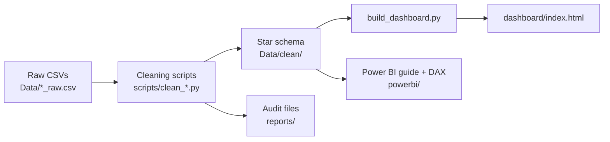

# E-Commerce Sales & Profitability Analysis

**End-to-end data analyst project:** data profiling → cleaning → star-schema modeling → KPI analysis → interactive dashboard, built with Python (pandas) and a self-contained HTML dashboard. A Power BI build guide and DAX measures are included.

🔗 **[Live interactive dashboard](https://nehpatildata.github.io/ecommerce-sales-analysis/dashboard/)** · or open `dashboard/index.html` locally (no server, no internet needed)

## Headline results

Revenue 	Profit	 Margin 	Orders	 Customers
$29.37M	    $6.73M	  22.92%	24,905	  2,000

## Table of Contents

1. [Business problem](#1-business-problem)
2. [Dataset](#2-dataset)
3. [Approach & pipeline](#3-approach--pipeline)
4. [Data quality findings](#4-data-quality-findings)
5. [Data model](#5-data-model-star-schema)
6. [KPIs](#6-kpis)
7. [Analysis & insights](#7-analysis--insights)
8. [Recommendations](#8-recommendations)
9. [Dashboard](#9-dashboard)
10. [Assumptions & limitations](#10-assumptions--limitations)
11. [Project structure](#11-project-structure)
12. [How to run](#12-how-to-run)
13. [Skills demonstrated](#13-skills-demonstrated)
14. [Future improvements](#14-future-improvements)
15. [How this project was built](#15-how-this-project-was-built)
16. [Author](#16-author)

---

## 1. Business problem

An e-commerce company wants to turn raw transactional data into decisions. The questions this project answers:

1. How much revenue and profit does the business generate?
2. How do sales and profit change over time?
3. Which products and categories drive revenue and profit?
4. Which regions and states contribute most?
5. Which high-revenue products have weak margins, and **why**?
6. How do discounts affect profitability?

---

## 2. Dataset

| Item | Raw | Cleaned |
|---|---|---|
| Orders | 25,050 | 24,905 |
| Customers | 2,010 | 2,000 |
| Products | 100 | 100 |
| Regions (states) | 20 | 20 |

- **Period:** Jan 2024 – Dec 2025
- **Source:** `[add source: Kaggle link / self-generated practice dataset]`. The data appears synthetic (see [limitations](#10-assumptions--limitations)).
- **Raw files (never modified):** `orders_raw.csv`, `customers_raw.csv`, `products_raw.csv`, `regions_raw.csv`

---

## 3. Approach & pipeline



Each stage is scripted, so the full project can be regenerated from the raw files with one command (see [How to run](#12-how-to-run)).

**Design principles**

- Raw data is **never edited**; every change is made by a script.
- Problems are **flagged before rows are excluded**, and excluded rows are saved to an audit file, not silently deleted.
- Every cleaning script validates its own output (row counts, key integrity).

---

## 4. Data quality findings

| Issue | Count | Treatment |
|---|---|---|
| Exact duplicate order rows | 50 | Removed |
| Orders with missing `customer_id` | 60 | Excluded from fact table; saved to `reports/removed_orders.csv` |
| Orders with missing `product_id` | 35 | Excluded from fact table; saved to `reports/removed_orders.csv` |
| Invalid order dates | 10 | Kept; date blanked and flagged `is_invalid_date` (revenue still counted in totals, excluded from time trends) |
| Negative quantities (returns) | 15 | Kept; flagged `is_return` |
| Duplicate customer records | 10 | Removed (exact duplicates; audit in `reports/`) |
| Category spelling variants (case/whitespace) | 12 rows, 8 variants → 5 categories | Standardized |
| Category / sub-category mismatches | 0 | Validated; flag column kept in `dim_product` |

**Reconciliation:** 25,050 raw − 50 duplicates − 95 missing-key orders = **24,905** final orders.

**Why exclude the 95 orders instead of mapping them to "Unknown"?** They cannot be attributed to a customer or product, so they would distort customer- and product-level analysis. They represent only **$121K (0.41%) of raw revenue**, so the impact on headline KPIs is negligible, and they are preserved in the audit file.

**Returns:** Revenue and profit are reported **net of returns** (15 return rows, ≈ −$18K sales). On return rows `sales_amount` is negative while `cost_amount` stays positive (inventory recovered), so `profit = sales_amount + cost_amount` for those rows and `sales_amount − cost_amount` otherwise.

---

## 5. Data model (star schema)


*Relationships as built in Power BI Desktop: one fact table in the centre, four dimensions, all one-to-many with filters flowing from dimension to fact.*

**Logical model**

```text
                    ┌─────────────────────┐
                    │    dim_customer     │
                    │─────────────────────│
                    │ PK customer_id      │
                    │ customer_name       │
                    │ gender              │
                    │ age                 │
                    │ customer_segment    │
                    │ signup_date         │
                    └──────────┬──────────┘
                               │ 1 : *
┌─────────────────┐      ┌─────▼──────────────────┐      ┌─────────────────┐
│   dim_product   │      │      fact_orders       │      │   dim_region    │
│─────────────────│ 1:*  │────────────────────────│  *:1 │─────────────────│
│ PK product_id   │◄─────│ FK product_id          │─────►│ PK region_id    │
│ product_name    │      │ FK customer_id         │      │ state           │
│ category        │      │ FK region_id           │      │ city            │
│ sub_category    │      │ FK order_date          │      │ region          │
│ cost            │      │ quantity               │      └─────────────────┘
│ selling_price   │      │ discount               │
└─────────────────┘      │ sales_amount           │
                         │ cost_amount            │
                         │ profit                 │
                         │ is_return              │
                         │ data-quality flags     │
                         └──────────┬─────────────┘
                                    │ * : 1  (order_date = date)
                         ┌──────────▼─────────────┐
                         │        dim_date        │
                         │────────────────────────│
                         │ PK date                │
                         │ date_key, day, month   │
                         │ month_name, quarter    │
                         │ year                   │
                         └────────────────────────┘
```

| Table | Grain / purpose |
|---|---|
| `fact_orders` | One row per order line: sales, cost, profit, discount, quality flags |
| `dim_customer` | Customer attributes and segment |
| `dim_product` | Product attributes with standardized category |
| `dim_region` | State and region |
| `dim_date` | Calendar attributes, joined on `order_date` |

Referential integrity was validated: **0 orphan customer, product or region keys** in the fact table.

---

## 6. KPIs

| KPI | Definition | Result |
|---|---|---|
| Revenue | Sum of `sales_amount` (net of returns) | **$29.37M** |
| Profit | Sum of `profit` | **$6.73M** |
| Profit margin | Profit ÷ Revenue | **22.92%** |
| Orders | Count of cleaned orders | **24,905** |
| Customers | Distinct `customer_id` | **2,000** |

> Currency: the source data does not state a currency; values are shown with the source's `$` notation.

---

## 7. Analysis & insights

### 7.1 Discounts are the strongest margin driver

| Discount | Revenue | Margin |
|---|---|---|
| 0% | $13.07M | 26.9% |
| 5% | $7.42M | 23.3% |
| 10% | $5.52M | 19.0% |
| 15% | $2.61M | 14.1% |
| 20% | $0.78M | 9.5% |

About 3,240 orders (≈ $3.4M revenue) sit in the 15–20% tiers at a blended margin of ~13%, roughly 10 points below the 0% tier. *(Excludes return rows. This shows association; whether discounts drove volume is not testable with this data.)*

### 7.2 High-revenue, low-margin products

Among the **top 25 products by revenue, 9 earn a margin below the 22.92% company average**. Together they generate **$4.40M revenue but only $718K profit (16.30% margin)**.

Discounting is **not** the cause: their average discount is **5.4%**, identical to the rest of the business (5.35%). Their **list-price margin is 20.6% vs 35.3%** for the other top-25 products, pointing to **cost or pricing structure**.

**Top 5 products by revenue**

| Rank | Product | Revenue | Margin |
|---|---|---|---|
| 1 | Kids Product 98 | $823,498 | 38.5% |
| 2 | Tables Product 97 | $728,151 | 29.0% |
| 3 | Storage Product 83 | $699,203 | 26.4% |
| 4 | Appliances Product 99 | $692,576 | 32.9% |
| 5 | Appliances Product 50 | $663,823 | 30.3% |

### 7.3 Category performance

| Category | Revenue | Margin |
|---|---|---|
| Clothing | $7.23M | 23.5% |
| Home & Kitchen | $7.08M | 23.1% |
| Furniture | $5.47M | 25.3% |
| Office Supplies | $5.33M | 20.4% |
| Electronics | $4.27M | 21.7% |

Furniture has the highest margin (25.3%); Office Supplies the lowest (20.4%).

### 7.4 Regional performance

| Region | States | Revenue | Profit | Margin |
|-------  |-------|-------- |--------|--------|
| North   | 5     | $7.54M  | $1.71M | 22.7% |
| East    | 5     | $7.34M  | $1.69M | 23.1% |
| South   | 5     | $7.34M  | $1.69M | 23.0% |
| West    | 4     | $5.74M  | $1.32M | 23.0% |
| Central | 1     | $1.41M  | $0.32M | 22.3% |

Margins are nearly identical (22.3–23.1%). **Central looks small only because it contains a single state**; revenue per state is $1.41M–$1.51M in *every* region. Regional gaps therefore reflect state count, not performance, so state-level analysis is more informative than region comparisons.

### 7.5 Time trend and customers

- **Revenue is flat year over year:** $14.65M (2024) vs $14.71M (2025), excluding the 10 orders with invalid dates.
- **No meaningful seasonality:** monthly revenue stays within ~$1.08M–$1.32M; February is the lowest month in both years.
- **Customer revenue is not concentrated:** the top 10% of customers generate only 17.4% of revenue (top 20%: 31.4%), and 55 of 100 products account for 80% of revenue. Consumer is 64% of revenue, Corporate 22%, Small Business 14%.

---

## 8. Recommendations

1. **Investigate cost/price structure of the 9 low-margin top-25 products.** Raising their margin to the company average would add ≈ **$291K profit** ($4.40M × 6.6 pts). Since discounting is not the cause, review supplier cost and list price before changing promotions.
2. **Review discount governance for the 15–20% tiers.** These orders earn ~13% margin versus ~27% at no discount; test whether the volume they create justifies the margin given up.
3. **Analyze performance at state level**, not region level, given the uneven region composition.
4. **Prioritize margin over volume for Office Supplies and Electronics**, the two lowest-margin categories.

---

## 9. Dashboard

👉 **[Open the live dashboard](https://nehpatildata.github.io/ecommerce-sales-analysis/dashboard/)** (hosted on GitHub Pages)


- KPI cards: revenue, profit, orders, customers, margin
- Monthly sales and profit trend
- Revenue by category · Profit by region · Top products by revenue
- Interactive filters: **year, region, category**
- Works offline: one self-contained HTML file (vanilla JavaScript + SVG, no CDN)

**Validation:** dashboard totals were checked against the source fact table (revenue $29,374,086.19, profit $6,732,332.30, 24,905 orders, 2,000 customers), and filtered scenarios were compared against independent calculations.

**Power BI:** a `.pbix` is not included. `powerbi/POWER_BI_BUILD_GUIDE.md` documents the model, relationships, visuals and validation steps, and `powerbi/measures.dax` contains the DAX measures.

---

## 10. Assumptions & limitations

- **Synthetic-looking data:** uniform per-state revenue and flat trends suggest a generated dataset, so findings demonstrate method rather than real-world business conclusions.
- **Currency** is not defined in the source (see [KPIs](#6-kpis)).
- **Uneven regions:** Central has one state; `city` values in `dim_region` are placeholders and are not used in analysis.
- **Two years of data** limit seasonality and trend conclusions.
- **Correlation, not causation:** the discount–margin relationship is descriptive; no experiment or price-elasticity data is available.
- **Invalid-date orders (10)** are included in totals but excluded from time-based views.

---

## 11. Project structure

```text
ecommerce-sales-analysis/
├── Data/
│   ├── *_raw.csv              # original data, never modified
│   └── clean/                 # star schema: fact_orders + 4 dimensions
├── scripts/
│   ├── clean_customers.py
│   ├── clean_products.py
│   ├── clean_regions.py
│   ├── clean_orders.py
│   ├── build_dashboard.py
│   └── run_all.py             # runs the full pipeline
├── reports/                   # audit files (removed orders, duplicate customers)
├── dashboard/index.html       # interactive dashboard
├── powerbi/                   # DAX measures, theme, build guide
├── images/                    # screenshots
├── requirements.txt
└── README.md
```

---

## 12. How to run

```bash
git clone https://github.com/NehpatilData/ecommerce-sales-analysis.git
cd ecommerce-sales-analysis
python -m pip install -r requirements.txt

# Regenerate everything (cleaning → star schema → dashboard)
python scripts/run_all.py
```

Expected result: `Data/clean/fact_orders.csv` with **24,905 rows** and `reports/removed_orders.csv` with **95 rows**.

To just view the dashboard, open `dashboard/index.html` in a browser.

---

## 13. Skills demonstrated

Data profiling · Data cleaning & validation · Audit trails · Star-schema modeling · KPI design · Exploratory analysis · Discount/margin analysis · Dashboard development · Business storytelling · DAX (documented, `.pbix` not built) · Git/GitHub

---

## 14. Future improvements

- SQL layer: load the star schema into SQLite/PostgreSQL with analytical queries (joins, CTEs, window functions)
- Return-rate analysis using flagged return transactions
- Customer segmentation (RFM)
- State-level profitability deep dive
- Publish a `.pbix` Power BI report

---

 ## 15. How this project was built

I built this project with AI coding agents (Cursor AI and Cline) under my direction. I defined the business problem, analytical scope and data-quality rules, then reviewed the profiling results, cleaning decisions, star-schema design, KPI calculations and dashboard output. Claude (Anthropic) was used for an independent project review, which identified a mismatch between the cleaning script and the delivered data; I fixed it and added an audit file and a one-command pipeline. AI accelerated implementation; the analytical direction and interpretation are mine.

---

## 16. Author

NEHA UMESH PATIL · linkedin-(https://www.linkedin.com/in/neha-patil-907a602b1/?utm_source=chatgpt.com)· [GitHub]-(https://github.com/NehpatilData) · [Live Dashboard](https://nehpatildata.github.io/ecommerce-sales-analysis/dashboard/) · `your.email@example.com`
